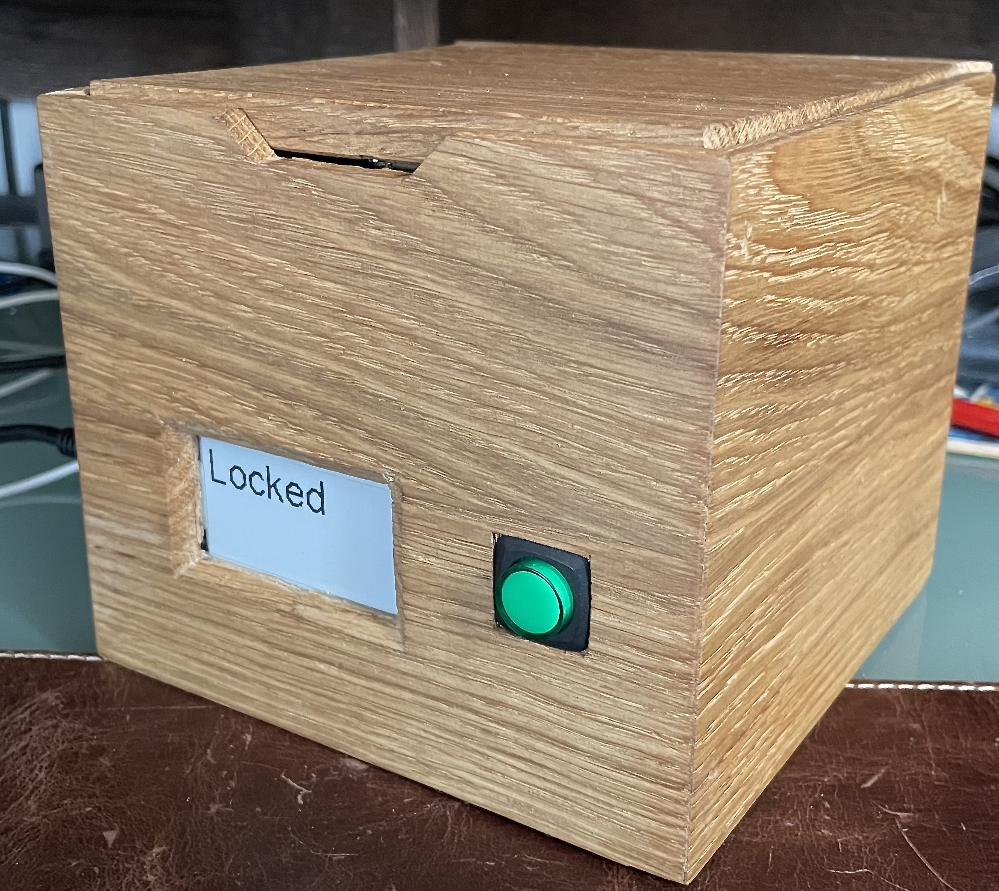
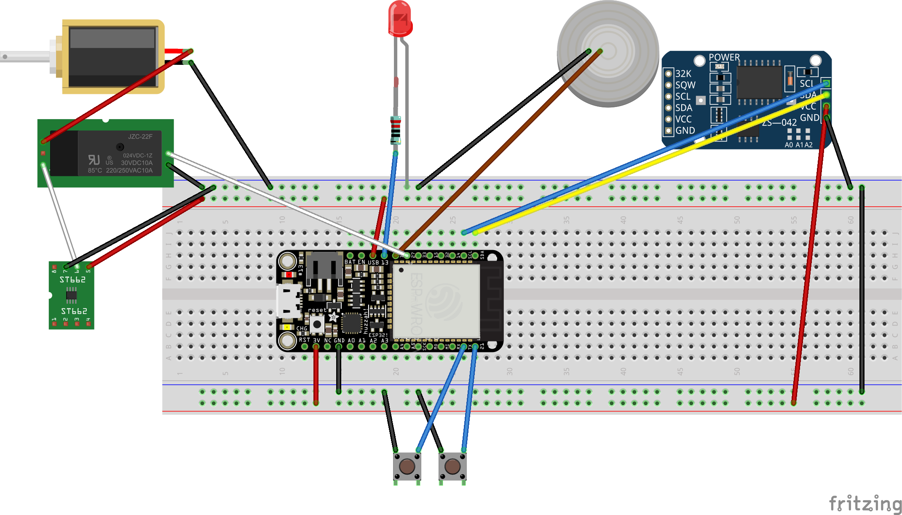

# LockBox
An software for creating a remotely controlled LockBox using ESP32, a solenoid lock and other sensors.

Now with Chaster.app integration

Fot this project I used:
 * Adafruit Huzzah32
 * Adafruit monochrome epaper display feather wing
 * 12v solenoid lock (you may use the 5v version available on Adafuit shop but will need modifications in the code or on the lock)
 * 5v to 12v converter (if using 12v lock)
 * DS3231 RTC module from AliExpress
 * Simple Relay
 * End of travel sensor or something similar or button (I used a button with integrates spring salvaged from an old device)
 * Push button
 * A LED (integrated in the button in my case)

## Build
 * Copy the file lockbox.h.dist to lockbox.h and set your wifi credentials
 * Compile and upload the code using Arduino IDE
 * Upload the web file to the ESP32 using the method described here (Arduino IDE 1.8 needed): https://randomnerdtutorials.com/install-esp32-filesystem-uploader-arduino-ide/
 * Have fun

## Schema
Here you can find an example of a schema for this. 

The e-paper display is not represented, and the component may not be accurate.

NOTE: Using the 5v to 12v converter requires a 3A power supply, you may want to power it using 12v and have a 12v to 5v converter for the Microcontroller
